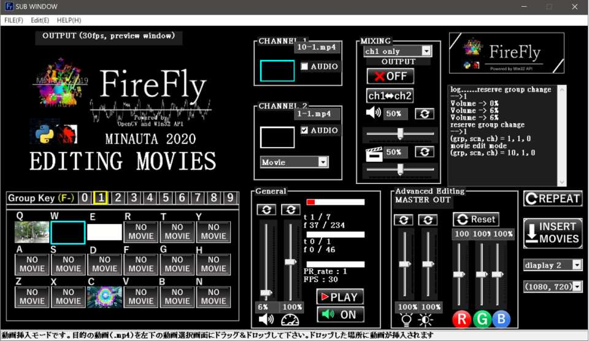

# VJ-flier
文化祭で使用した簡易VJソフト

[FireFly](https://www.gizmodo.jp/2007/07/vjvjfirefly.html)がUIの元になっている

## Requirements
- Windows でしか動きません、、、、
- FHDの動画をぬるぬる動かそうと思うとメモリ4GBは必須。エフェクトを追加するなら8GBくらい合ったほうが良いかも

## screenshot
C++版：

 
## Release
[ここ](https://drive.google.com/drive/folders/1gH60uo779e8hMrvrxw1CQcCo8lLfAkAu?usp=sharing)からダウンロードして下さい。
解凍後、run.exeを実行するとアプリが起動します

## How to Use
ユーザガイドが[リリース](https://drive.google.com/drive/folders/1gH60uo779e8hMrvrxw1CQcCo8lLfAkAu?usp=sharing)に付属しています。

## バージョン情報

**debug\_0222**

(Google Driveの保存容量の関係から削除)

1. 最初のデモモードのexe共有用
2. （以下、昨年版からの追加機能）
3. ドラッグアンドドロップで動画ファイルを読み込み
4. コントラスト、明るさ調整
5. 音量調整
6. USBカメラ、各種入力端子、内部カメラからの入力を投影
7. 二つの動画を重ねて表示（加算、減算）

**debug\_0222\_2**

(Google Driveの保存容量の関係から削除)

1. 異なる解像度の動画でも重ねて表示できるようになった
2. 動画の合成に「乗算」モード追加
3. ステータスバーの文字追加
4. 動画を挿入するときに音声ON/OFFの選択肢を表示
5. コマンドプロンプトのwindowを削除

**release\_0223**

1. 高解像度（主に1080ｐ以上）の動画をデュアルディスプレイで再生したときに再生速度が落ちてフリーズする問題を、FPSを強制的に落とすことで解決
2. 動画取り込み時に動画のwidthとheightをリサイズできるようにした
3. 動画再生処理の高速化
4. 動画読み込みの拡張子を「mp4」のみから「mp4, avi, mov, wmv」の4種類に追加
5. 全画面表示モニターの位置設定がバグることがあったので解消
6. ステータスバーの文字を一部変更

**release\_0225**

1. 動画を上書きする時にフリーズする問題を解決
2. Tab + アルファベットキーの同時押しで、再生していない方のChannelの動画を変更
3. 音量とコントラストのリセットボタンの位置を変更
4. 動画のリサイズの進捗表示
5. RGBのエフェクトの変更
6. 画像をリソースファイルに取り込む(一部)

**release\_0226**

1. サムネイル画像の字度保存を削除
2. 速度調整のアルゴリズムを変更
3. FPSのリアルタイム表示
4. TAB+アルファベットの操作のバグを解消

　　（以前のバージョンはカメラを起動している時に一部フリーズしていた）

1. 動画再生速度の高速化（軽量化）
2. Progress Barがはみ出て表示される問題を解決

**release\_0303**

1. CAMを二回連続で選択したときにフリーズするエラーを解消
2. メニュー内容を変更
3. CH2の動画がうまく再生されない（再生速度が速い、全コマ再生されない等）の問題を解消

**release\_0303**

1. メニューでコマンドを実行したときに発生するエラーを解消

2. 使い方（PDF）を添付

**release\_0329**

1. PDF修正
2. **これが現状**** UDP ****通信なしの最終版**

**release\_0529**

1. UDP通信により、WiFiまたはEatheNetで接続された複数（最大10台）のPCと操作を同期することが可能に
2. Python版ではUDP通信のIPアドレスは.pyファイルに直接書き込んでいたが、C++版（ **release\_0529** )ではIPアドレスを割り当てるダイアログボックスを作成
3. 同期内容→再生する動画、再生速度、音量、終了コマンド
4. （カメラ映像、チャンネル設定等は同期していない）

**・現時点での不具合**** / ****改良予定**

1. 一部のカメラを表示したときに全画面出力にならない　→ solved( release 0223 )
2. 動画読み込み時の自動resize　→ solved( release 0223 )
3. 再生していない方のChの動画選択→solved(release 0225)
4. Thumbnailの画像が毎度保存されるて容量が大きくなる→solved(release 0226)
5. Progress Bar がたまにはみ出て表示されることがある→solved(release 0226)
6. FPSのリアルタイム表示→solved(release 0226)
7. 速度を変更したときにバグる→solved(release 0226)
8. TCP/IP通信を用いて、複数のPC同士で同時ストリーミング→solved(release\_0529)
9. wavファイルの読み込み、動画読み込み時にAVI→mp4に変換
10. 複数のプロジェクタに動画表示
11. 動画読み込み後の変換フォーマットをmp4に統一
12. テキスト、Echoエフェクトの追加